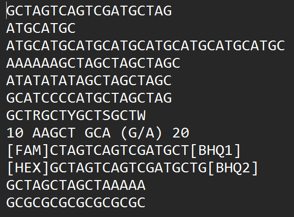
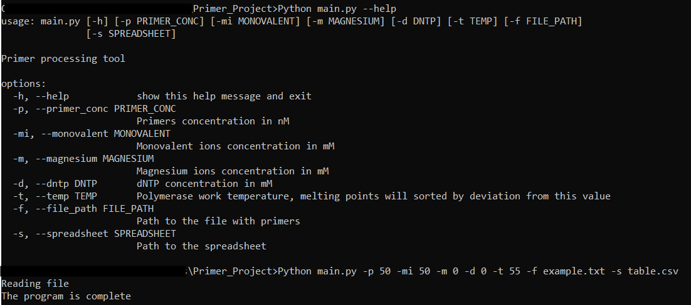
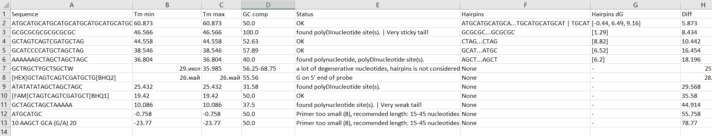

# Primer Analyzer
A tool for scientist to select the optimal primers or probes from a list.

## Main functions
- Cleaning the sequences of unnecessary characters
- Calculation of Tm and hairpin stability ($\Delta G$ at the melting temperature)
- Sequence structure analysis
- Automated design recommendations
- Exporting results to CSV spreadsheets

## Technology stack
- Python 3.x
- Pandas

## Installation and start
1. **Clone the repository:**
```
git clone [https://github.com](https://github.com/IvanKoscheev/Primer_Analyzer)
```
2. **Install libraries:**
```
pip install -r requirements.txt
```
3. **Usage** 
```
python main.py -p [primer] -mi [monovalent]] -m [magnesium] -d [dNTP] -t [temp] -f [file path] -s [output path]
```
- `-p`  : **Primer concentration** (nM).
- `-mi` : **Monovalent ions concentration** (mM) — e.g., $Na^+$, $K^+$.
- `-m`  : **Magnesium ions concentration** ($Mg^{2+}$) (mM).
- `-d`  : **dNTPs concentration** (mM).
- `-t`  : **Target melting temperature** (°C). The output table will be sorted so that primers with Tm closest to this value appear at the top.
- `-f`  : **File path** — path to your input '.txt' file with sequences.
- `-s`  : **Spreadsheet path** — name or path for the output '.csv' file. 

## Example of work:

*Example of the input .txt file structure*

*Running the script with parameters*

*Result spreadsheet (autoformatting as dates in cells is Excel issue)*

## Disclaimer
This software is for **educational and research purposes only**. For clinical or professional diagnostic use, please rely on certified professional software.

## Feedback & Testing
If you are a researcher with access to a lab and would like to test these calculations *in vitro*, I would be incredibly grateful! 
If you use this tool to design primers, please share your results (e.g., how the predicted $T_m$ compares to the experimental data)
**Contact me:** [ivankosch29@proton.me]
